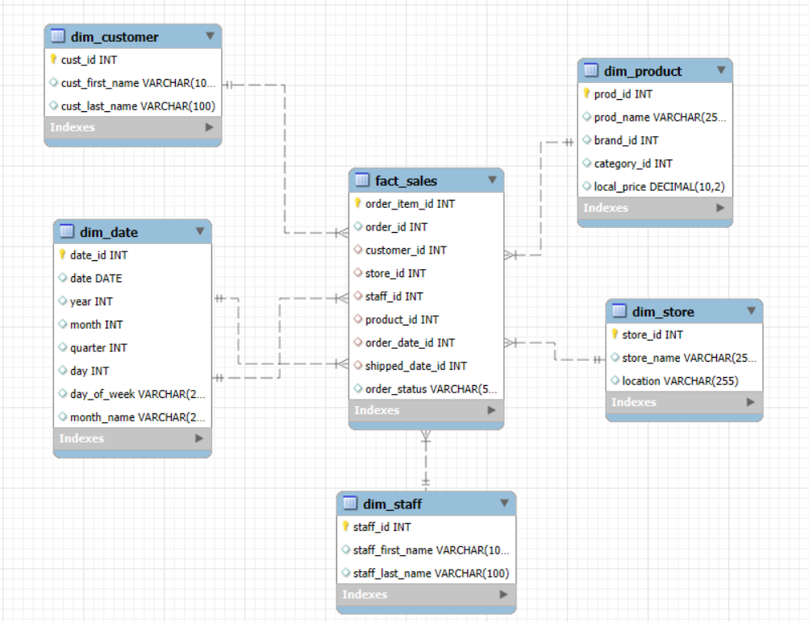

# End-to-End ETL Using Python

## 📌 Overview

This repository demonstrates a complete **ETL (Extract, Transform, Load) pipeline** using Python. It covers the workflow from raw data extraction to building a data mart, performing data quality checks, and generating insights with visualizations.

---

## 🗂️ Project Structure

```
DB_Connection/       # Database connection scripts
DataLake/            # Raw data storage
Information_Mart/    # Final processed data
Visualizations/      # Generated charts
extracted/           # Extracted datasets
staging_1/           # First staging layer
staging_2/           # Second staging layer
Extraction.py        # Data extraction script
Transformation.py    # Data cleaning and transformation script
Modeling.py          # Aggregation / modeling script
Quality_check.py     # Data quality validation
Visualization.py     # Generate charts & visualizations
main.py              # Main pipeline execution
schema_model.db      # Database schema
data_mart.db         # Final data mart
Schema_Diagram.png   # ER diagram of the database
requirements.txt     # Python dependencies
```

---

## 🔹 Steps Taken

### 1. **Extract**

* Raw data collected from different sources and stored in `DataLake/` and `extracted/`.
* `Extraction.py` automates the extraction process.

### 2. **Transform**

* `Transformation.py` performs data cleaning and preparation:

  * Remove duplicates and invalid records
  * Handle missing values
  * Convert datatypes
  * Create staging tables in `staging_1/` & `staging_2/`

### 3. **Load**

* `Modeling.py` loads transformed data into the **data mart** (`Information_Mart/`).
* Database schema stored in `schema_model.db` and visualized in `Schema_Diagram.png`.

### 4. **Data Quality Checks**

* `Quality_check.py` validates:

  * No missing or inconsistent data
  * Correct data types and formats

### 5. **Visualization & Insights**

* `Visualization.py` generates charts saved in `Visualizations/`.
* Key insights from the data:

  * [Add 2–3 main findings here]

**Sample Charts:**


**Database Schema:**



---

##  Challenges Encountered

* Handling inconsistent/missing data across multiple sources.
* Designing multiple staging layers for better transformations.
* Ensuring ETL scripts are modular and reusable.
* Optimizing queries and transformations for performance.

---

##  How to Run

### **Option 1: Run Full Pipeline (Recommended)**

1. Clone the repository:

```bash
git clone https://github.com/keroloshany47/End_To_End_ETL_Using_Python.git
```

2. Install dependencies:

```bash
pip install -r requirements.txt
```

3. Configure database connection in `DB_Connection/` if needed (SQLite databases are included).
4. Run the full pipeline:

```bash
python main.py
```

5. Check `Visualizations/` for generated charts.

---

### **Option 2: Run Each Step Individually**

Run the scripts in the following order:

1. **Extraction**

```bash
python Extraction.py
```

2. **Transformation**

```bash
python Transformation.py
```

3. **Modeling / Load to Data Mart**

```bash
python Modeling.py
```

4. **Data Quality Check**

```bash
python Quality_check.py
```

5. **Visualization**

```bash
python Visualization.py
```

After each step, outputs and processed data will be saved in their respective folders (`staging_1/`, `staging_2/`, `Information_Mart/`, `Visualizations/`).

---

##  Conclusion

This project demonstrates a complete **ETL workflow** with Python, from raw data extraction to building a data mart and generating meaningful insights. The pipeline is modular, reusable, and scalable for new datasets.

---
.
هل تحب أعمل ده دلوقتي؟
